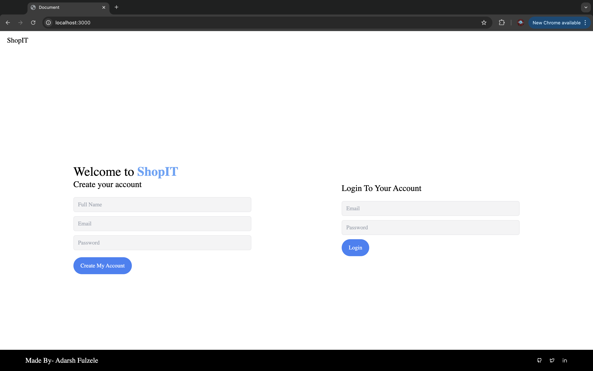
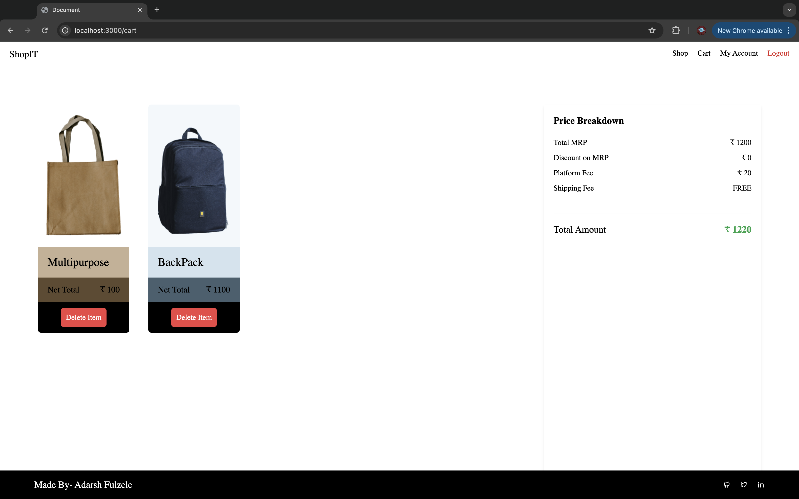

# Project Title: Basic Shop Website  
**SHOP IT**

A comprehensive backend application designed for efficient data management using MongoDB. This project facilitates seamless integration with a frontend application, providing robust API endpoints for various operations. It is beginner-friendly, making it a great opportunity to practice backend development and understand the concepts of backend programming.

## Features

- **User Authentication**: Secure user registration and login functionalities.
- **Data Management**: CRUD operations for managing user and product data.
- **JWT Authentication**: JSON Web Token-based authentication for secure API access.
- **Session Management**: Utilizes Express sessions for maintaining user sessions.
- **Environment Configuration**: Flexible configuration using .env files to manage sensitive data securely.


## Installation And Setup

Instructions on how to install and set up your project.

1. **Clone the repository:**
   ```bash
   git clone https://github.com/adarsh912/ShopIT_BasicEcommerceWebsite.git
   cd ShopIT_BasicEcommerceWebsite

2. **Install dependencies**
    ```bash
    npm install

3. **Create a .env file in the root directory and add your environment variables**
    ```bash
    JWT_KEY=your_jwt_key,
    EXPRESS_SESSION_SECRET=your_session_secret,
    MONGODB_URI=your_mongodb_uri,

5. **Start the Application**
   Run the app locally using:

       ``` npm start
    
   Or, for automatic restarts on file changes:

       ``` npx nodemon app.js

6. **Access the application**
      
      Visit `localhost:3000` on your web browser and you will see the home page.

7. **Adding Products**  
Go to **My Account** → **Create New Product** to upload an image, set the price, discount price, and other details. Below are the details for the first four products, which can serve as a reference for achieving the perfect UI experience and functionality.

    - **Product 1: Clinge Bag**
        - Price: 1200
        - Discount: 0
        - Background Color: #F4DDD2
        - Panel Color: #DEBEAE
        - Text Color: #774F3D

    - **Product 2: BackPack**
        - Price: 1100
        - Discount: 0
        - Background Color: #F3F8FB
        - Panel Color: #D3E4EE
        - Text Color: #48606E

    - **Product 3: Multipurpose**
        - Price: 100
        - Discount: 0
        - Background Color: #DEDOBF
        - Panel Color: #C5B095
        - Text Color: #5F4A30

    - **Product 4: Pink Attack**
        - Price: 1400
        - Discount: 25
        - Background Color: #F4E0E1
        - Panel Color: #E3C4C6
        - Text Color: #816264


## Screenshots

**Home Page**
  

**Shop**
  

**Cart**
  

**All Products**
  

**Create New Item**
  

**Edit Exisiting Products**
  

<!-- <table>
  <tr>
    <td></td>
    <td></td>
  </tr>
  <tr>
    <td><strong>Login Alert</strong></td>
    <td><strong>New Product Alert</strong></td>
  </tr>
</table> -->

Made with ❤️ by Adarsh Fulzele
